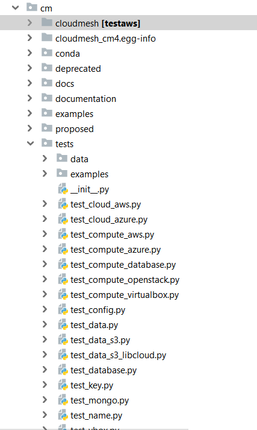

# Nosetest

Nosetest is a utility to unit test python code. 

## Installation
The nose module can be installed with the help of pip utility

```python
$ pip install nose
```

This will install the nose module in the current Python distribution as well 
as a nosetest.exe, which means the test can be run using this utility as well as using –m switch.

## Directory structure in cloudmesh

Test cases can be placed in the cm/tests directory.

{#fig:nosetest-screenshot1}

## Test Case execution 

Once you are in the cm directory, testcases can be executed using.

```python
$ nosetests -v --nocapture tests/test_data_s3.py
```
nose collects tests from unittest.TestCase subclasses, of course. We can also write simple test functions, as well as test classes that are not subclasses of unittest.TestCase. nose also supplies a number of helpful functions for writing timed tests, testing for exceptions, and other common use cases.

Example
:Let us consider nosetest.py

```python
# content of nosetest.py
def func(x):
   return x + 1
   def test_answer():
   assert func(3) == 5
```
In order to run the above test, use the following command line syntax −

```python
C:\python>nosetests –v nosetest.py
```

The output displayed on console will be as follows −

```python
nosetest.test_answer ... FAIL
================================================================
FAIL: nosetest.test_answer
----------------------------------------------------------------------
Traceback (most recent call last):
   File "C:\Python34\lib\site-packages\nose\case.py", line 198, in runTest
      self.test(*self.arg)
   File "C:\Python34\nosetest.py", line 6, in test_answer
      assert func(3) == 5
AssertionError
----------------------------------------------------------------------
Ran 1 test in 0.000s
FAILED (failures = 1)
result = nose.run()
```

The result will be true if the test run is successful, or false if it fails or raises an uncaught exception.
nose supports fixtures (setup and teardown methods) at the package, module, class, and test level. As with py.test or unittest fixtures, setup always runs before any test (or collection of tests for test packages and modules); teardown runs if setup has completed successfully, regardless of the status of the test run.
